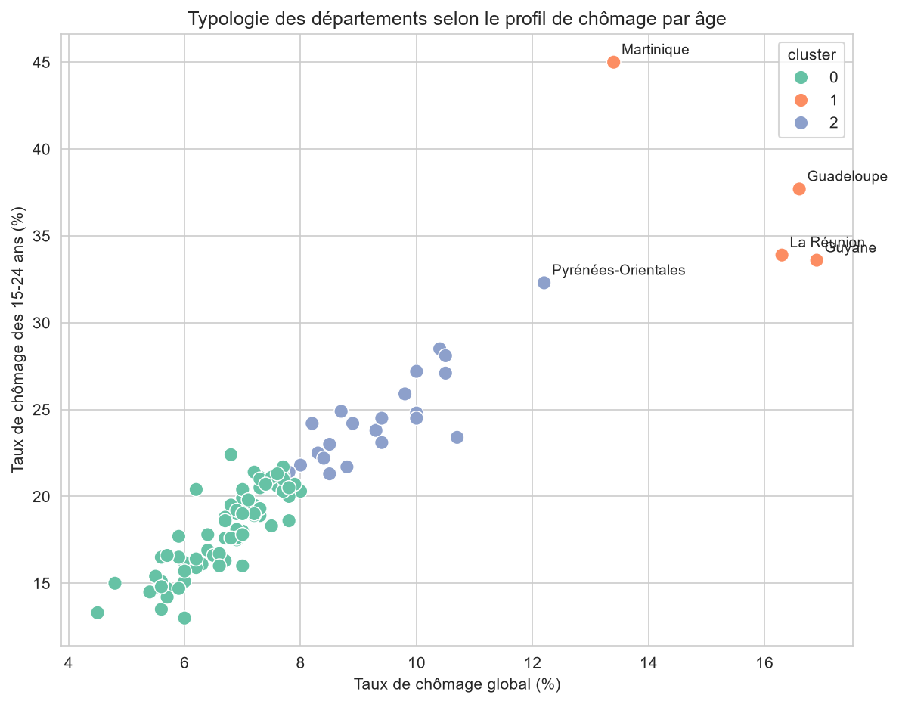

# Chômage des jeunes en France par département (2025)

Analyse exploratoire des disparités territoriales du chômage des jeunes 
(15-24 ans) en France, et de leur lien avec le chômage des autres tranches 
d'âge.

---

## Problématique

**Le chômage des jeunes (15-24 ans) suit-il les mêmes disparités 
territoriales que celui des autres tranches d'âge ?**

L'objectif est d'étudier les disparités départementales du chômage des 
jeunes et de déterminer si les territoires les plus touchés présentent 
également des niveaux de chômage élevés chez les autres tranches d'âge.

---

## 📁 Données

- **Source** : Insee, taux de chômage localisés, 2025
- **Niveau géographique** : département (100 départements après 
  nettoyage, France métropolitaine + DOM pour les tableaux et graphiques ; 
  96 départements de métropole pour la carte, faute de contours DOM 
  disponibles dans la source cartographique utilisée)
- **Variables** : taux de chômage global, par tranche d'âge (15-24, 25-49, 
  50 ans ou plus), et écart hommes-femmes

---

## Approche méthodologique

L'analyse suit plusieurs étapes :

- Nettoyage et préparation des données départementales
- Fusion des données relatives aux différentes tranches d'âge
- Analyse descriptive des taux de chômage
- Comparaison entre les 15-24 ans, les 25-49 ans et les 50 ans ou plus
- Test de **Wilcoxon** pour comparer les niveaux de chômage entre les 
  tranches d'âge
- Corrélation de **Spearman** pour étudier les associations entre les 
  disparités territoriales
- **K-means** pour identifier des profils de départements
- Test de **Kruskal-Wallis** pour comparer les niveaux de chômage entre 
  les profils
- Cartographie des disparités territoriales

---

## 📊 Principaux résultats

- Le taux de chômage des 15-24 ans varie de **13 % à 45 %** selon le 
  département (moyenne : **20,3 %**), et est nettement supérieur à celui 
  des autres tranches d'âge — différence confirmée statistiquement par le 
  test de Wilcoxon (**p < 0,001**).
- Une **forte association** est observée entre le chômage des jeunes et 
  celui des 25-49 ans (**ρ = 0,91**), ainsi qu'entre les jeunes et les 
  50 ans ou plus (**ρ = 0,80**), avec **p < 0,001**.
- Les départements présentant les niveaux de chômage des jeunes les plus 
  élevés sont généralement également caractérisés par des niveaux de 
  chômage plus élevés chez les autres tranches d'âge.
- La classification par **K-means** met en évidence **trois profils 
  territoriaux** selon les niveaux de chômage.
- Le test de **Kruskal-Wallis** montre que les niveaux de chômage des 
  jeunes diffèrent significativement entre ces trois profils 
  (**H = 56,77 ; p < 0,001**).

---

## 🗺️ Profils territoriaux

La classification fait apparaître trois grands profils :

- **Profil 1 – chômage relativement faible** (~74 départements) : 
  niveaux de chômage plus faibles pour les trois tranches d'âge étudiées.
- **Profil 3 – chômage intermédiaire** (~22 départements) : niveaux de 
  chômage situés entre les deux autres profils.
- **Profil 2 – chômage très élevé** (4 départements : Guadeloupe, 
  Martinique, Guyane, La Réunion) : niveaux particulièrement élevés pour 
  l'ensemble des tranches d'âge, avec un taux moyen de **37,6 %** chez 
  les 15-24 ans.

Ces profils montrent que les disparités territoriales du chômage des 
jeunes s'inscrivent également dans des écarts plus larges entre les 
départements.

## 📈 Aperçu visuel




---

## ⚠️ Limites

Cette première étude est **exploratoire** et porte sur les données 
disponibles pour **2025**.

Les corrélations et les regroupements statistiques permettent d'identifier 
des associations et des profils territoriaux, mais **ne permettent pas 
d'établir de lien de causalité**.

L'analyse ne prend pas encore en compte certaines caractéristiques 
susceptibles d'être associées au chômage des jeunes, notamment :

- le sexe ;
- le niveau de diplôme ;
- le domaine de formation ;
- les caractéristiques du marché du travail local.

---

## Perspectives

Cette analyse constitue une **première étape** du projet.

L'objectif est de poursuivre l'étude avec les **données 2026** afin 
d'analyser l'évolution des disparités territoriales entre 2025 et 2026.

L'étude pourra également être enrichie par le croisement avec des 
variables complémentaires, notamment **le sexe, le niveau de diplôme et 
le domaine de formation**, afin de mieux caractériser les profils des 
jeunes exposés au chômage et d'étudier les différences entre territoires.

Cette seconde étape permettra ainsi de passer d'une première analyse 
territoriale à une analyse plus approfondie des **profils et facteurs 
associés au chômage des jeunes**.

---

## Technologies

Python, Pandas, Matplotlib, Seaborn, Scikit-learn, SciPy, GeoPandas

## 📂 Structure du projet

```
chomage-jeunes-insee/
├── data/
│   └── 50_MTS-52_CHO.xlsx
├── figures/
│   ├── carte_chomage_jeunes.png
│   └── typologie_clusters.png
├── notebook.ipynb
└── README.md
```

## ▶️ Utilisation

```bash
pip install pandas numpy matplotlib seaborn scikit-learn scipy geopandas openpyxl
jupyter notebook notebook.ipynb
```
